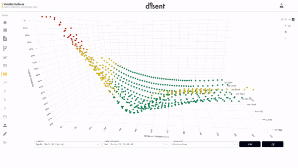

.. Disent Client for Python3 documentation master file, created by
   sphinx-quickstart on Sat Jun 11 15:52:18 2022.
   You can adapt this file completely to your liking, but it should at least
   contain the root `toctree` directive.

.. toctree::
   :numbered:
   :maxdepth: 5
   :caption: Docs:
   
.. sectnum::

Welcome to the main page for the Disent client library. Currently supports Python3.8.x+. Docs presume familiary with basic python, pandas, numpy, and derivatives 🤑.

Quickstart
==================

.. _link: https://pypi.org/project/disentpy/

Available on PyPi (`link`_) via :code:`pip`.

.. code-block:: console

   (venv) $ pip install disentpy

.. code-block:: python3

   >>> import disent
   >>> disent.example()
   Downloaded........ 134.0 KiB done.
         TCK   MNY        YRS        IV    T                   DT
   0    AAPL  0.00   0.079452  0.791190   1M  2022-07-11T00:00:00
   1    AAPL  0.00   0.164384  0.740517   2M  2022-08-11T00:00:00
   ..    ...   ...        ...       ...  ...                  ...
   718  AAPL  2.95   7.002740  0.303335   7Y  2029-06-11T00:00:00
   719  AAPL  2.95  10.005479  0.303335  10Y  2032-06-11T00:00:00

   [720 rows x 6 columns]

When using :code:`disent.example()` you'll get a :code:`pandas.DataFrame` showing a modeled equity volatlity surface derived from public domain AAPL options chains. This is a wrapper on :ref:`disent.hub() <hub>`.

First time users will prompted for a key:

.. code-block:: python3

   >>> disent.example()
   Secrets file not found. See docs.
   Enter your API-Key to continue:

See section on :ref:`keys <keys_section>`

Tutorials
==================

The following walkthroughs will give users a flavor of Disent's API capabilities and built in analytics.

Market Data Retrieval
--------------------------

**Use case** "I'm a technologist at an asset manager, how can I pull modeled data out of Disent?"

.. Observable market quotes
.. ~~~~~~~~~~~~~~~~~~~~~~~~~

.. *(todo)*

.. Fully inverted surface (black implied)
.. ~~~~~~~~~~~~~~~~~~~~~~~~~~~~~~~~~~~~~~~

.. *(todo)*

.. Normalized OTC surface
.. ~~~~~~~~~~~~~~~~~~~~~~~~~~

.. _hub:

When using :code:`disent.hub()` you'll get a :code:`pandas.DataFrame`:

.. code:: python3

   >>> model="DEMO_EQD_VOLS"
   >>> ticker = 'AAPL'
   >>> model_args = {'ticker':ticker}
   >>> df = disent.hub(model,model_args)
   >>> df

.. table::
   :align: center

   +------+------+-----------+----------+-----+---------------------+
   | TCK  | MNY  | YRS       | IV       | T   | DT                  |
   +======+======+===========+==========+=====+=====================+
   | AAPL | 0.00 | 0.079452  | 0.791190 | 1M  | 2022-07-11T00:00:00 |
   +------+------+-----------+----------+-----+---------------------+
   | AAPL | 0.00 | 0.164384  | 0.740517 | 2M  | 2022-08-11T00:00:00 |
   +------+------+-----------+----------+-----+---------------------+
   | ...  | ...  | ...       | ...      | ... | ...                 |
   +------+------+-----------+----------+-----+---------------------+
   | AAPL | 2.95 | 7.002740  | 0.303335 | 7Y  | 2029-06-11T00:00:00 |
   +------+------+-----------+----------+-----+---------------------+
   | AAPL | 2.95 | 10.005479 | 0.303335 | 10Y | 2032-06-11T00:00:00 |
   +------+------+-----------+----------+-----+---------------------+

.. note::
   
   Various configurations and settings are available for enterprise subscribers. Below is describing the specifics of the **DEMO_EQD_VOLS** default model.

*Descriptive columns*

.. _OCC: https://www.theocc.com/Market-Data/Market-Data-Reports/Series-and-Trading-Data/Directory-of-Listed-Products
  
- :math:`\text{TCK}s` are the option contract root symbols using standard exchange root codes (`OCC`_) root symbols.

- :math:`\text{MNY}s` are defined as :math:`f(S,K) = \displaystyle\frac{K}{S}` bucketed into a pre-defined moneyness scale.

- :math:`\text{T}s` are rolling contract maturities, i.e. durations/tenors/time periods (akin to :code:`datetime.timedelta`), bucketed into a classic tenor scale:

.. list-table::
   :align: center

   * - 1M
     - 3M
     - 6M
     - 1Y
     - 5Y
     - 10Y

Across the Disent platform rolling tenors include two helpers:

.. _ISO8601: https://en.wikipedia.org/wiki/ISO_8601

- :math:`\text{DT}s` are expressed as `ISO8601`_ strings as :math:`\text{ACT}` days from today (:math:`t_0`). Use :code:`pandas.to_datetime()` for conversion. :math:`\text{ACT}` is :math:`[t_0+T]`

.. _convention: https://en.wikipedia.org/wiki/Day_count_convention

- :math:`\text{YRS}s` are the year fractions from today and :math:`\text{DT}` using :math:`\text{ACT/365 Fixed}` `convention`_.

*Evalauted columns*

.. _Black-Scholes-Merton: https://en.wikipedia.org/wiki/Black%E2%80%93Scholes_model
.. _spline-based interpolation: https://en.wikipedia.org/wiki/Spline_interpolation

- :math:`\text{IV}s` is the implied volatlity. It is derived using a Disent-specific implementation of `Black-Scholes-Merton`_ using `spline-based interpolation`_.

.. _click here: https://snpricer.disent.com/secondary/vol-surfaces

   Professional subcsribers can access the advanced features here (`click here`_).

Portfolio Valuation
-------------------------

**Use case** "I manage a book at a fund, how can I load my book into Disent and get an on-the-fly full revaluation?"

*(todo) Coming soon*

Model integration
-------------------------

**Use case** "I'm a PhD researcher, I have a proprietary model for my firm written in C++, I would like to integrate it to Disent so that it can be coupled with our market/static data and deployed to my users."

*(todo) Coming soon*

Scenario Analysis
-------------------------

**Use case** "I'm a trader executing a risk-neutral strategy, I need to simulate the P&L on my book based on what-if scenarios in the spot price of a variety of assets. I'll use the results as part of planning my hedging.""

*(todo) Coming soon*

Price an Exotic
-------------------------

**Use case** "I'm on the phone with a client/dealer and we're going back and forth on the price of a basket option. I want to pay around with the pricing parameters to try and see where a good level to close may be."

*(todo) Coming soon*

Backtest a Strategy
-------------------------

**Use case** "I'm in sales and a new client is asking for a specific type of enhanced yield. I want to impress, so let's search out a strategy that makes money 99% of the time."

*(todo) Coming soon*

Auth and Envs
=====================

This section details how to request keys for application authentification as well as facilities for selecting which environments data is coming from (local/dev/prod, etc..).

.. _keys_section:

Authentification keys
----------------------

.. _publickey@disent.com: mailto://publickeys@disent.com
.. _support@disent.com: mailto://support@disent.com

- **Public users** request a public key via email to `publickey@disent.com`_. Next release will have the ability to generate on-the-fly.
- **Subscribers** see private documentation or contact `support@disent.com`_.

Environment selection
------------------

* public (default)

List current environment
~~~~~~~~~~~~~~~~~~~~~~~~~~~~

.. code-block:: python3

   >>> disent.env.get()
   public

Change (set) environment
~~~~~~~~~~~~~~~~~~~~~~~~~~~~

.. code-block:: python3

   >>> disent.set.set('prod')
   public --> prod

API Reference
========================

*(todo) Coming soon*

.. * :ref:`genindex`
.. * :ref:`modindex`
.. * :ref:`search`

